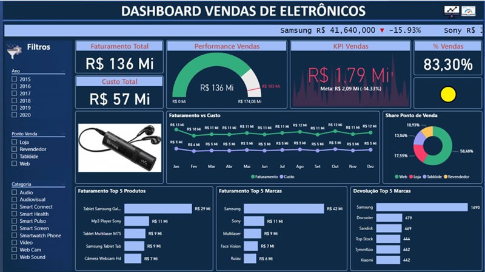

  

<h1 align="center"> Portfólio de Análise de Dados</h1>

  <strong> Lidiane Vaz</strong> 
  <em>Em transição de carreira para a área de Dados</em>

---

  <a href="#sobre-mim">Sobre Mim</a> •
  <a href="#certificados">Certificados</a> • 
  <a href="#meus-projetos">Meus Projetos</a> • 
  <a href="#resumo-dos-meus-estudos">Resumo dos Meus Estudos</a> • 
  <a href="#tecnologias-em-estudo">Tecnologias em estudo</a> • 
  <a href="#contato">Contato</a>

---

## Sobre Mim

Sou apaixonada por transformar dados em decisões!  
Neste espaço, compartilho minha jornada prática com <strong>Python</strong>, <strong>SQL</strong>, <strong>Power BI</strong> e <strong>Excel</strong> — incluindo arquivos, projetos e resumos em PDF.

---

## Certificados

### 📄 Curso de Power BI - Alura
📥 [Ver Certificado PDF](documentos/certificado-powerbi.pdf)

### 📄 Curso de Python para Dados - DIO
📥 [Ver Certificado PDF](documentos/certificado-python.pdf)

---

## Meus Projetos

### 📊 Análise de Vendas com Power BI

**Descrição**: Dashboard criado com Power BI para análise de vendas mensais, lucro e metas por região.  

🔗 [Ver Projeto no GitHub](https://https://github.com/vazlidiane/projeto-git-aprendizado)

---

### 🐍 Análise de Dados com Python e Pandas

**Descrição**: Script em Python que automatiza a limpeza e análise de dados de vendas com Pandas.  
🔗 [Ver Projeto no GitHub](https://github.com/vazlidiane/projeto-python)

---

## Resumo dos Meus Estudos

| Dia | Tema       | Descrição                                 |
|-----|------------|-------------------------------------------|
| 01  | Python     | Listas, dicionários, leitura de CSV       |
| 02  | SQL        | SELECT, WHERE, ORDER BY                   |
| 03  | Power BI   | Importação de dados e gráficos            |
| 04  | Excel      | Fórmulas, filtros e tabela dinâmica       |
| 05  | Integração | Python, SQL e Power BI juntos             |

---

## Resumo em PDF

📥 [Clique aqui para baixar o PDF do resumo](https://raw.githubusercontent.com/vazlidiane/projeto-git-aprendizado/main/Projeto%20Git%20Aprendizado/documentos/diario-estudos-analise-dados.pdf)

---

## Tecnologias em estudo

- Python (pandas, matplotlib)
- SQL (consultas básicas)
- Power BI (dashboards e visualizações)
- Excel (funções e filtros)
- Git e GitHub (controle de versão)

---

## Contato

> Obrigado por visitar meu portfólio! 

